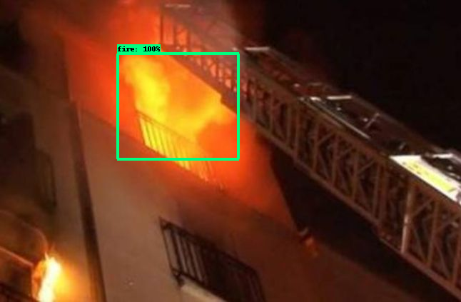
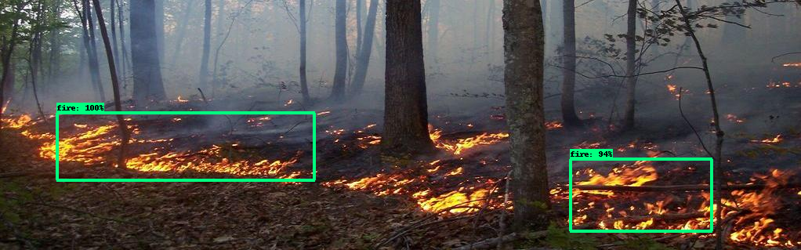

# Fire-Detection

## TFOD Model ZOO
> [Click Here](https://github.com/tensorflow/models/blob/master/research/object_detection/g3doc/tf2_detection_zoo.md)

## Model Used

`For Version 1`
> [SSD MobileNet V2 FPNLite 640x640](http://download.tensorflow.org/models/object_detection/tf2/20200711/ssd_mobilenet_v2_fpnlite_640x640_coco17_tpu-8.tar.gz)

## Output




## Project Structure
```
.
├── Custom_Fire_Detection_TFOD2_0.ipynb
├── README.md
├── assets
│   ├── output_one.png
│   └── output_two.png
└── training_demo
    ├── anotations
    │   └── label_map.pbtxt
    ├── export_tflite_graph_tf2.py
    ├── exported_models
    ├── exporter_main_v2.py
    ├── generate_tfrecord.py
    ├── images
    ├── model_main_tf2.py
    ├── models
    │   └── pipeline.config
    └── pre-trained-models
```


## Saved Models
Click [Here](http://bit.ly/Fire-Detection-Models)
